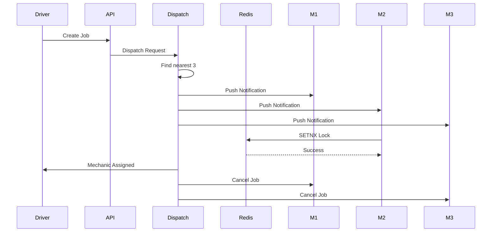

# MechHub Nepal — Comprehensive Technical Blueprint

## Executive Summary

MechHub Nepal's competitive advantage is not merely finding mechanics faster—it is creating a dispatch and payout infrastructure that simultaneously optimizes:

1. **Driver Experience** → Immediate mechanic assignment.
2. **Mechanic Experience** → Consistent work and same-day payouts.
3. **Platform Economics** → High fulfillment and retention.

The core architecture combines:

* Simultaneous dispatch to the nearest 3 mechanics.
* Redis SETNX distributed locking.
* 60-second automated escalation.
* Event-driven backend architecture.
* Daily 6 PM payout engine.
* Zone-based operational management.

---

# System Architecture

```text
┌──────────────────────────────┐
│        Driver App            │
│        React Native          │
└──────────────┬───────────────┘
               │ HTTPS
               ▼
┌──────────────────────────────┐
│         API Gateway          │
└──────────────┬───────────────┘
               │
      ┌────────┴────────┐
      ▼                 ▼
┌──────────────┐  ┌──────────────┐
│ Auth Service │  │ User Service │
└──────────────┘  └──────────────┘

               │
               ▼

┌──────────────────────────────┐
│      Dispatch Service        │
└──────────────┬───────────────┘
               │
     ┌─────────┼─────────┐
     ▼         ▼         ▼

┌─────────┐ ┌─────────┐ ┌─────────┐
│ Redis   │ │PostGIS  │ │FCM Push │
│ Cluster │ │Database │ │Service  │
└─────────┘ └─────────┘ └─────────┘

               │
               ▼

┌──────────────────────────────┐
│      Redis Streams           │
│      Event Bus               │
└──────────────┬───────────────┘
               │
 ┌─────────────┼─────────────┐
 ▼             ▼             ▼

Escalation   Analytics     Payout
Daemon       Service       Service

               │
               ▼

      Zone Captain Dashboard
```

---

# Service Responsibilities

| Service            | Responsibility             |
| ------------------ | -------------------------- |
| Auth Service       | Authentication, JWT        |
| Dispatch Service   | Mechanic matching          |
| Redis              | Locks, caching, queues     |
| PostgreSQL/PostGIS | Core transactional storage |
| Escalation Daemon  | Timeout handling           |
| Payout Service     | Daily settlement           |
| Analytics Service  | KPIs and reporting         |
| Zone Captain Tool  | Operations monitoring      |

---

# Database Design

## Mechanics

```sql
CREATE TABLE mechanics (
    id UUID PRIMARY KEY,
    full_name VARCHAR(255),
    phone VARCHAR(50),

    latitude DECIMAL,
    longitude DECIMAL,

    rating DECIMAL(2,1),

    status VARCHAR(20),
    zone_id UUID,

    wallet_balance NUMERIC(12,2),

    created_at TIMESTAMP
);
```

---

## Jobs

```sql
CREATE TABLE jobs (
    id UUID PRIMARY KEY,

    driver_id UUID,
    mechanic_id UUID,

    service_type VARCHAR(100),

    latitude DECIMAL,
    longitude DECIMAL,

    status VARCHAR(50),

    dispatch_round INTEGER DEFAULT 1,

    created_at TIMESTAMP,
    assigned_at TIMESTAMP,
    completed_at TIMESTAMP
);
```

---

## Earnings Ledger

```sql
CREATE TABLE mechanic_earnings (
    id UUID PRIMARY KEY,

    mechanic_id UUID,
    job_id UUID,

    gross_amount NUMERIC,
    platform_fee NUMERIC,
    net_amount NUMERIC,

    payout_status VARCHAR(20),

    created_at TIMESTAMP
);
```

---

# Dispatch Algorithm

## Design Principle

Never wait on one mechanic.

Dispatch simultaneously.

---

# Dispatch Sequence



---

# Geospatial Search

Using PostGIS.

## Nearest Mechanics

```sql
SELECT
    id,
    rating,
    location
FROM mechanics
WHERE status='AVAILABLE'
ORDER BY location <-> ST_SetSRID(
    ST_MakePoint(:lng,:lat),
    4326
)
LIMIT 3;
```

---

# Simultaneous Notification Engine

```typescript
await Promise.all([
    notify(mechanicA),
    notify(mechanicB),
    notify(mechanicC)
]);
```

All notifications fire at exactly the same time.

No priority bias.

---

# Redis SETNX Lock

## Problem

Three mechanics may press Accept simultaneously.

Need a single winner.

---

## Lock Strategy

```text
job_lock:{job_id}
```

Example:

```text
job_lock:job_456
```

---

## Lock Acquisition

```typescript
const accepted = await redis.set(
    `job_lock:${jobId}`,
    mechanicId,
    {
        NX: true,
        EX: 300
    }
);
```

---

## Success

```text
OK
```

Mechanic wins assignment.

---

## Failure

```text
null
```

Another mechanic already secured the lock.

---

# Assignment Transaction

```typescript
await db.transaction(async (trx) => {

    await trx.jobs.update({
        id: jobId
    }, {
        status: "ASSIGNED",
        mechanic_id: mechanicId
    });

});
```

---

# Notification Cancellation

Once lock succeeds:

```typescript
publish("JOB_ASSIGNED", {
    jobId,
    mechanicId
});
```

Consumers:

```text
Push Service
Analytics
Driver Updates
Mechanic Updates
```

---

# Event-Driven Architecture

## Events

```text
JOB_CREATED

JOB_DISPATCHED

JOB_ACCEPTED

JOB_ESCALATED

MECHANIC_ARRIVED

JOB_COMPLETED

PAYOUT_CREATED

PAYOUT_SETTLED
```

---

# Redis Streams

```typescript
await redis.xadd(
    "dispatch-events",
    "*",
    {
       event: "JOB_ACCEPTED",
       jobId
    }
);
```

---

# 60-Second Escalation Protocol

## Why

Top 3 mechanics may ignore the request.

Need guaranteed fulfillment.

---

# Escalation Daemon

Independent service.

```text
dispatch-escalation-worker
```

Runs continuously.

```typescript
while(true){

   await scanPendingJobs();

   await sleep(5000);

}
```

---

# Escalation Scan

```sql
SELECT *
FROM jobs
WHERE status='PENDING';
```

---

# Timeout Detection

```typescript
const age =
Date.now() - job.createdAt;

if(age > 60000){

   escalate(job);

}
```

---

# Escalation Levels

## Round 1

```text
Nearest 3 Mechanics
Radius: 3 km
```

---

## Round 2

```text
Radius: 5 km
```

Dispatch next 3.

---

## Round 3

```text
Radius: 8 km
```

Dispatch next 3.

---

## Round 4

```text
Entire Zone Broadcast
```

Kathmandu Zone.

---

# Escalation State Machine

```text
PENDING
   │
   ▼
ROUND_1
   │
60 sec
   ▼
ROUND_2
   │
60 sec
   ▼
ROUND_3
   │
60 sec
   ▼
ZONE_BROADCAST
   │
   ▼
ASSIGNED
```

---

# Mechanic Mobile App Flow

## Online Screen

```text
Status Toggle

ONLINE
OFFLINE
```

---

## Incoming Job Card

```text
Vehicle Type

Distance

Estimated Earnings

Accept Button

Decline Button
```

---

## Accepted Job

```text
Driver Information

Navigation

Call Driver

Complete Job
```

---

# Driver App Flow

## Request Screen

```text
Vehicle Type

Current Location

Problem Description
```

---

## Matching Screen

```text
Finding Nearby Mechanics...
```

Target:

```text
< 60 seconds
```

---

## Assigned Screen

```text
Mechanic Name

Live ETA

Contact Button
```

---

# Daily Payout System (Retention Moat)

## Strategic Reasoning

Most Nepalese roadside mechanics operate on daily cash liquidity.

Competitors usually settle:

```text
Weekly
Biweekly
Monthly
```

MechHub settles:

```text
Same Day
6 PM
Every Day
```

This becomes a major retention mechanism.

---

# Earnings Creation

Job completed.

```typescript
await createLedgerEntry({

    mechanicId,

    jobId,

    grossAmount: 1500,

    platformFee: 150,

    netAmount: 1350

});
```

---

# Ledger Entry

```json
{
  "job":"JOB123",
  "gross":1500,
  "fee":150,
  "net":1350
}
```

---

# Daily Payout Scheduler

Runs every day.

```text
18:00 Asia/Kathmandu
```

---

## Payout Sequence

```mermaid
sequenceDiagram

participant Ledger
participant PayoutService
participant Wallet
participant Mechanic

Ledger->>PayoutService:
Aggregate Earnings

PayoutService->>Wallet:
Credit Balance

Wallet->>Mechanic:
Payout Notification

PayoutService->>Ledger:
Mark Settled
```

---

# Aggregation Query

```sql
SELECT
    mechanic_id,
    SUM(net_amount)
FROM mechanic_earnings
WHERE payout_status='PENDING'
GROUP BY mechanic_id;
```

---

# Wallet Credit

```typescript
wallet.balance += totalDailyEarnings;
```

---

# Settlement Update

```sql
UPDATE mechanic_earnings
SET payout_status='SETTLED'
WHERE mechanic_id=:id
AND payout_status='PENDING';
```

---

# Zone Captain Operations Dashboard

## Real-Time Metrics

```text
Online Mechanics

Pending Jobs

Average Response Time

Fulfillment Rate

Escalation Rate

Zone Revenue
```

---

## Emergency Controls

```text
Force Broadcast

Mechanic Suspension

Zone Expansion

Dispatch Override
```

---

# Kathmandu Launch Architecture

### Phase 1

```text
Kathmandu
Lalitpur
Bhaktapur
```

Primary objective:

```text
Demand Density
```

---

### Phase 2

Expansion corridors:

```text
BP Highway

Prithvi Highway
```

Create roadside mechanic clusters every major service corridor.

---

# Production Scalability Targets

| Metric              | Target   |
| ------------------- | -------- |
| Dispatch Time       | < 5 sec  |
| Mechanic Acceptance | < 20 sec |
| Driver Assignment   | < 60 sec |
| Redis Lock Latency  | < 50 ms  |
| Concurrent Jobs     | 10,000+  |
| Availability        | 99.9%    |

---

# Final Architecture Principle

The system should be optimized around a single operational equation:

```text
Driver Requests Help
        ↓
Top 3 Mechanics Notified Instantly
        ↓
Redis SETNX Guarantees One Winner
        ↓
60-Second Escalation Prevents Dead Ends
        ↓
Job Completed
        ↓
Ledger Updated
        ↓
6 PM Daily Payout
        ↓
Mechanic Retention Increases
        ↓
Network Density Improves
        ↓
Dispatch Gets Faster
```

This creates a self-reinforcing marketplace where faster dispatch attracts drivers, more jobs attract mechanics, and reliable same-day payouts keep the best mechanics active on MechHub Nepal.
